# Corporate Bond Relative-Value

Research-grade corporate-bond relative-value pipeline for testing whether transaction-cleaned issuer-curve residuals forecast future corporate-bond returns.

[](https://github.com/NimaTaheri1378/corporate-bond-relative-value/actions/workflows/public_repo_audit.yml)


## Executive summary

This repository is the public-safe release of a full-stack empirical fixed-income research project.

The private research pipeline ingests WRDS TRACE Enhanced corporate-bond transactions, cleans trade prints, joins FISD security-master data, builds issuer-date curve inputs, fits guarded issuer curves, converts curve residuals into bond-level relative-value features, creates leakage-aware monthly return labels, and compares transparent residual signals against Ridge, CPU LightGBM, and a GPU PyTorch MLP.

The public repo contains code, documentation, aggregate result tables, figures, dashboards, and tests. Raw WRDS/vendor data, local Parquet panels, protected caches, credentials, model binaries, and cluster logs are excluded.

## Research question

**Do bond-level deviations from a transaction-cleaned issuer-specific corporate-bond curve forecast future returns after controlling for liquidity, maturity, rating, amount outstanding, transaction costs, and nonlinear model alternatives?**

## Headline answer

**Yes, in this sample.** A transparent residual-rank signal survives out-of-sample testing, 10 bps turnover costs, and maturity-, liquidity-, rating-, and amount-neutral robustness checks. More complex models were useful diagnostics, but they did not beat the simple residual-rank signal on risk-adjusted net performance.

## Headline result

| Item | Public release value |
|---|---:|
| Selected research candidate | `composite_residual_rank`, next-month return |
| Portfolio construction | equal-weight top-minus-bottom decile |
| Cost assumption | 10 bps one-way turnover cost |
| Test sample | 2020-2024 |
| Mean monthly IC | 0.1034 |
| Mean net monthly return | 0.524% |
| Annualized net return | 6.291% |
| Annualized net volatility | 1.850% |
| Net Sharpe approximation | 3.401 |
| Cumulative net return | 36.741% |
| Max drawdown | -0.187% |
| Positive month share | 98.333% |
| Decision status | research candidate; not production/live trading |

## Visual results

| Portfolio validation | Model comparison |
|---|---|
|  |  |
| **Net cumulative performance.** The headline residual-rank strategy remains positive after 10 bps turnover costs. | **Model comparison.** Transparent residual ranking beats Ridge, CPU LightGBM, and GPU MLP on risk-adjusted net performance. |

| Risk profile | Interactive views |
|---|---|
|  | [`interactive cumulative return`](docs/assets/interactive/step08e_test_cumulative_net_return.html) |
| **Return vs drawdown.** Nonlinear models produce similar returns with materially worse drawdowns. | **Interactive figures.** Public-safe HTML dashboards are built from aggregate outputs only. |

## Robustness scorecard

| Construction | Annualized net return | Net Sharpe | Max drawdown |
|---|---:|---:|---:|
| Global | 6.291% | 3.401 | -0.187% |
| Maturity-neutral | 6.755% | 3.693 | -0.484% |
| Liquidity-neutral | 5.934% | 2.898 | -0.633% |
| Rating-neutral | 6.214% | 3.269 | -0.176% |
| Amount-neutral | 6.293% | 3.087 | -0.859% |

As-of exposure coverage:

```text
rating coverage:             98.783%
amount-outstanding coverage: 36.627%
coupon coverage:             100.000%
```

## Pipeline architecture

```mermaid
flowchart LR
    A[WRDS schema discovery] --> B[TRACE/FISD/returns extraction]
    B --> C[TRACE cleaning and security master]
    C --> D[TRACE-FISD joined panel]
    D --> E[Issuer-date curve inputs]
    E --> F[Guarded curve fitting]
    F --> G[Residual features]
    G --> H[Monthly return labels]
    H --> I[Transparent baselines]
    I --> J[GPU MLP and CPU LightGBM]
    J --> K[Cost-aware backtests]
    K --> L[Robustness and exposure audits]
    L --> M[Public-safe release]
```



## What is public here

| Component | Included? | Notes |
|---|---:|---|
| Research code structure | Yes | Package layout, scripts, configs, tests, documentation |
| Aggregate result tables | Yes | Public-safe summaries only; no row-level vendor panels |
| Static figures | Yes | Rendered aggregate research figures |
| Interactive dashboards | Yes | HTML dashboards built from aggregate summaries |
| Tests and CI audit | Yes | Smoke tests and public-release checks |
| Raw WRDS / TRACE / FISD / return data | No | Users must provide their own licensed access |
| Local Parquet panels and caches | No | Excluded by `.gitignore` and safety audit |
| Credentials, `.pgpass`, API keys, cluster logs | No | Excluded and scanned before release |
| Model binaries/state files | No | Excluded from public release |

## Public aggregate tables

Public-safe aggregate tables are in:

```text
docs/assets/tables/
```

Key files:

```text
step08e_model_leaderboard.csv
step08f_signal_robustness_metrics.csv
step08g_rating_amount_exposure_metrics.csv
step08g_rating_amount_exposure_summary.csv
step09a_public_safety_audit.json
```

## Quickstart

The public repository does not include proprietary data. It is intended to install, lint, test, and document the research code and public aggregate release.

```bash
mamba env create -f environment.yml
conda activate ml_core
pip install -e .

make smoke
make test
python scripts/step09a_public_safety_audit.py --workspace .
mkdocs build
```

## Repository map

```text
corporate-bond-relative-value/
├── README.md
├── DATA_ACCESS.md
├── configs/
├── docs/
│   ├── assets/
│   ├── methodology.md
│   ├── results.md
│   ├── robustness.md
│   ├── reproducibility.md
│   └── model_card.md
├── scripts/
├── src/
├── tests/
└── .github/workflows/
```

## Data policy

This public repository intentionally excludes raw WRDS/vendor data, credentials, local cluster logs, protected Parquet caches, model binaries, and private schema contracts. Users need their own WRDS/TRACE/FISD/return-data entitlements. See [`DATA_ACCESS.md`](DATA_ACCESS.md).

## Status and next credibility checks

This is a **research candidate**, not a deployed strategy. Before any real capital deployment, the next credibility checks would be independent replication, deeper execution-cost modeling, sector and issuer-family neutral implementations, multi-horizon labels, and live paper trading with frozen code.

## License

Code is released under the MIT License. Figures and documentation are intended for public research presentation only. Third-party data products are not redistributed.
