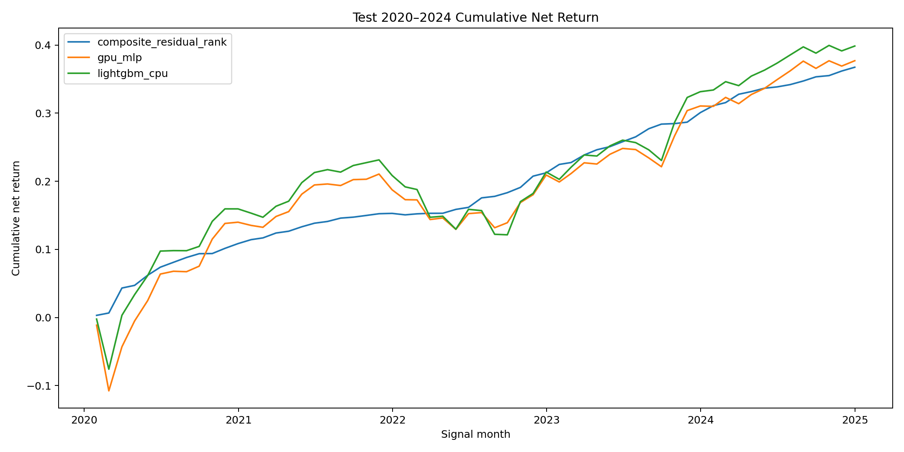
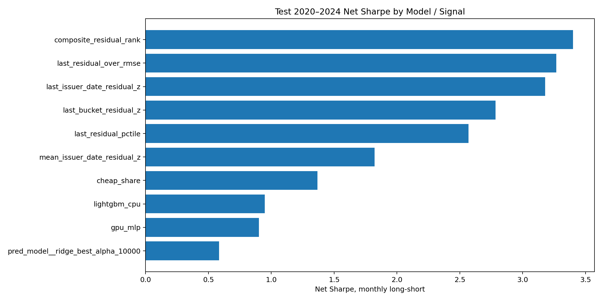
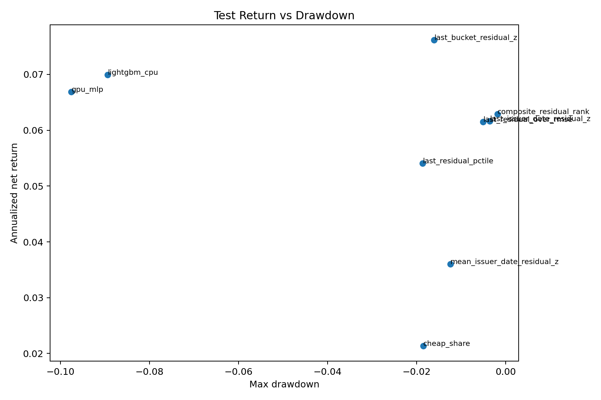

# Results

The headline public result is `composite_residual_rank`.

| Metric | Test 2020-2024 |
|---|---:|
| Mean monthly IC | 0.1034 |
| Mean net monthly return | 0.524% |
| Annualized net return | 6.291% |
| Annualized net volatility | 1.850% |
| Net Sharpe | 3.401 |
| Cumulative net return | 36.741% |
| Max drawdown | -0.187% |

